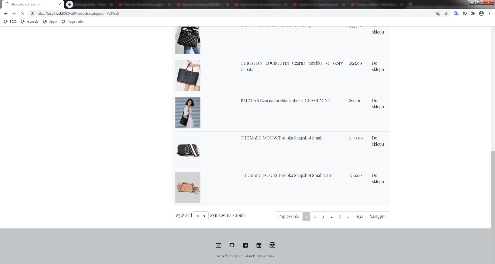

# Shopping comparison

Application for convenient search and observe products from your favourite luxury stores. 

Application is being developed using Spring Boot framework, and is based on MVC design pattern.
JSoup library was used to extract product data. 
View is generated dynamically using the Thymeleaf engine.

## Stack
- Backend: Java 8, Spring Boot, Spring Security, Hibernate, JSoup, REST, H2, JUnit4, Lombok, Maven
- Frontend: Thymeleaf, Bootstrap, HTML, CSS, JS
- Tools: GIT, Trello

## Features
- Searching products by name,
- Show products by type,
- User login/registration form,
- Form-based authentication,
- User credentials validation,
- H2 database for testing only

### Todo Features
- adding/deleting products from wishlist, 
- sending email with notification when product price is changed,
- configure external MySQL, instead of H2
- OAuth

## Deploy
You can see live application at:

https://shopping-comparison.herokuapp.com

If this is your first visit there, you have to probably wait couple seconds, 
since Spring is loading it's context and application starts scraping websites.  

After a period of inactivity Heroku kills application and it needs to be re-run.

### Examples of some features

